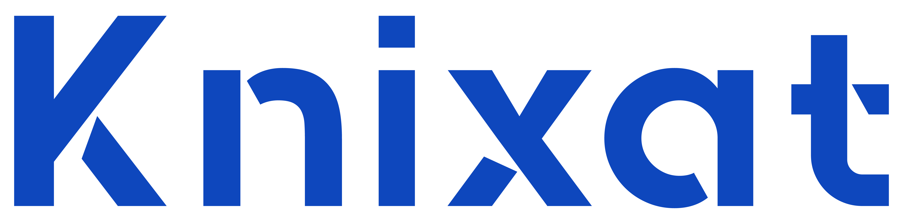

[Home](../README.md) | [Sprint 1](README.md)

---

    

# Knixat Cloud DevOps - Sprint 1

## 1) Compare cloud service providers and present findings.

This report outlines the comparison of various cloud services offered by Azure, AWS (Amazon Web Services), Google Cloud and Alibaba. The comparison table below is organized based on some of the popular services and the nomenclature of the respective cloud provider.

| Services              | Azure         | Amazon Web Services        | Google Cloud Platform   | Alibaba Cloud |
|-----------------------|-----------------------|--------------------------|-----------------------|-----------|
| **Virtual Machines** | Virtual Machines (VMs)|  EC2 Instances  | Compute Engine    | Elastic Compute Service |
| **Container Services** | Azure Kubernetes Service (AKS) | Amazon Elastic Kubernetes Service (EKS)   | Google Kubernets Engine  |   |
| **Serverless Computing** | Azure Functions  | AWS Lambda   | Cloud Functions  |   |
| **Object Storage** | Azure Blob Storage  | AWS Simple Storage Service (S3)   |  Cloud Storage |   |
| **File Storage** | Azure Files  |Amazon Elastic File System (EFS)   | Google Cloud File Store  |   |
| **Database Storage** | Azure Table Storage  | Amazon DynamoDB   |  Google BigTable |   |
| **Virtual Network** | Azure Virtual Network  | Amazon Virtual Private Cloud (VPC)   |  Virtual Private Cloud |   |
| **DNS Service** | Azure DNS  | Amazon Route 53   |   Google Cloud DNS|   |

## 2) Create an Azure storage account in your group Azure resource group.

Firstly, the name we choose for our group is **`knixat-group2`** and we have gone ahead to create a Resource Group using the group name. Please see the attached screenshot below showing the __`knixat-group2`__ resource group. In a bid to create a Storage account in the **`knixat-group2`** resource group, the following considerations were taken into account.

    

**Contact Us:**
Email: [admissions@knixat.com](mailto:admissions@email.com)
Website: [www.knixat.com](https://www.knixat.com)

&copy; 2023 Knixat. All Rights Reserved.

---

[Home](../README.md) | [Sprint 1](README.md)
