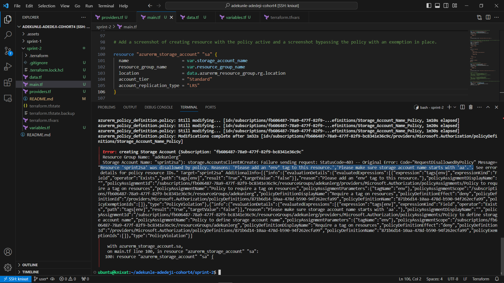
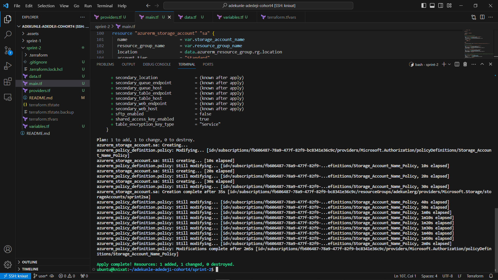
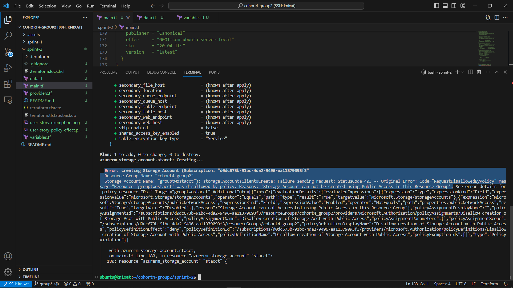
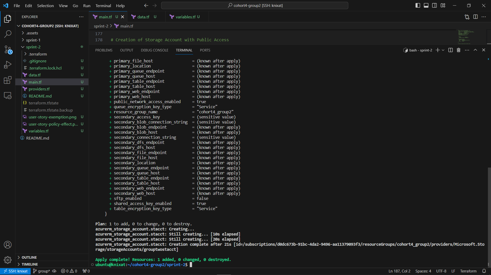
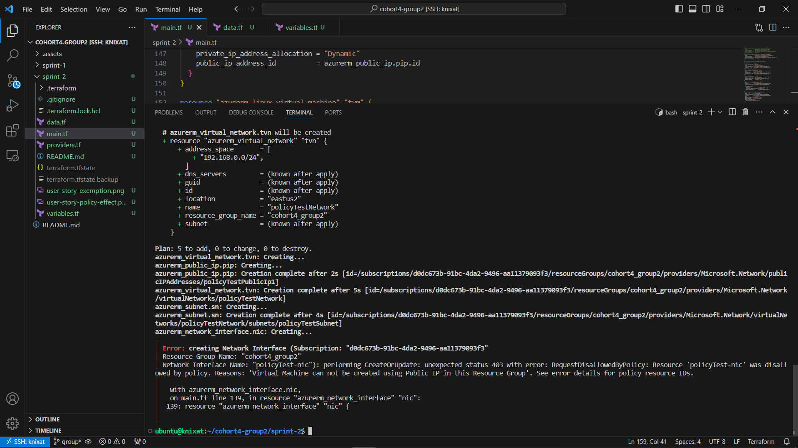
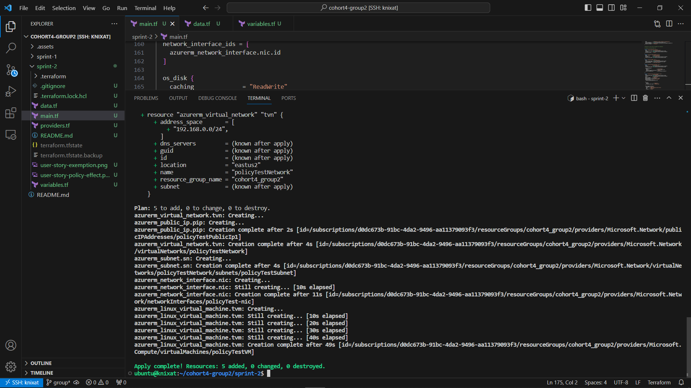

[Home](../README.md) | [Sprint 2](README.md)

---

<p align="right">
    
</p>

# Knixat Cloud DevOps - Sprint 2

## 1) Discuss and present the Azure policy created in the individual story.

```h
resource "azurerm_policy_definition" "policy" {
  name         = var.policy_name
  policy_type  = "Custom"
  mode         = "All"
  display_name = var.policy_name

  metadata = <<METADATA
    {
    "category": "Custom"
    }

METADATA


  policy_rule = <<POLICY_RULE
 {
    "if": {
      "allOf": [
        {
          "field": "type",
          "equals": "Microsoft.Storage/storageAccounts"
        },
        {
          "field": "name",
          "notLike": "aa*"
        }
      ]
    },
    "then": {
      "effect": "deny"
    }
  }
POLICY_RULE

}
```

The Azure Policy above ensures that only storage accounts with names starting with "aa" are created or modified within the assigned scope in your Azure environment. This policy was first developed and validated using the JSON format on the Azure Portal before deploying to the portal via terraform using `azurerm_policy_definition` resource.
<br> On the Azure portal, there are basically two(2) elements required to create the Policy Rule. The `mode` and `policyRule`. In this presentation, we will discuss each of the elements in the policy rule.

- **Mode**: The "mode" element in an Azure Policy determines which resource types are evaluated for a policy definition. There are two primary modes: **"All"** and **"Indexed"** and they differ in how they handle conditions. The supported mode `"All"` evaluate resource groups, subscriptions, and all resource types while `"indexed"` only evaluate resource types that support tags and location. In the policy definition above, the "mode" field is set to `"All"`.

- **Policy Rule**: The "policyRule" section defines the actual rule using If and Then blocks. The `"If block"` here targets the name field of all Storage Accounts not starting with `"aa"` while the `"Then block"` takes the action of the effect which denies the creation or modification of such Storage Accounts inside any Scope the policy is assigned to.

After we deloyed using Terraform, we also assigned the policy to a scope using `azurerm_resource_group_policy_assignment` with terraform. We the tested the policy by trying to deploy a storage account into the resource group that the policy was assigned and we got an error stating that the creation of the storage account was disallowed by a policy. We then created an exemption to that resource group using `azurerm_resource_group_policy_exemption`. We retried the deployment of the Storage Account which was successful now because of the exemption in place. Please see images below for senarios of Storage Account Deployment before and after the policy exemption.

- Command Line output on deployment of Storage Account with name not starting with `"aa"` before policy exemption.


- Command Line output on deployment of Storage Account with name not starting with `"aa"` before policy exemption.



## 3,4,5) Add a screenshot of creating resource with the policy active and a screenshot bypassing the policy with an exemption in place.

Please see the screenshots when policy is in effect and when bypassed with an exemption.

- Policy in effect for Storage Account Creation with Public Access

- Policy `exempted` for Storage Account Creation with Public Access

- Policy in effect for VM Creation with Public Ip

- Policy `exempted` for VM Creation with Public Ip

---

<p align="left">
    
</p>

**Contact Us:**  
Email: [admissions@knixat.com](mailto:admissions@email.com)  
Website: [www.knixat.com](https://www.knixat.com)

&copy; 2023 Knixat. All Rights Reserved.

---

[Home](../README.md) | [Sprint 2](README.md)